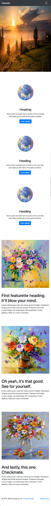

# Responsive Bootstrap Webpage

Create the webpage shown below in the reference image using **only** Bootstrap - no CSS should be necessary.

#### Instructions
1. Include Bootstrap from a CDN in the head of the `index.html` file.
2. Create the navigation bar using bootstrap's `navbar` component.
3. Make sure your homepage is responsive.
4. Add a slideshow using bootstrap's `carousel` component.
4. Create the 3-column section using bootstrap's `card` component:
    - A card with a header and body each
5. use bootstap's row class to create a grid like layout. 
    - Each card should be in a row, containing an image and some text.
6. lastly, Create a footer section for your page using bootstrap's `footer` component.

## The desktop overview

## The mobile overview

## Keep in mind

- Notice the layout differences in the mobile version by following the link below

- Try and make your webpage as close to the reference as possible

[Live Version](https://hsnakk.github.io/UIB_Framework_Bootstrap_Exercise-1/)

[//]: # (autograding info start)
#  Results
> ⌛ Give it a minute. As long as you see the orange dot  on top, CodeBuddy is still processing. Refresh this page to see it's current status.
>
> This is what CodeBuddy found when running your code. It is to show you what you have achieved and to give you hints on how to complete the exercise.

### Bootstrap

|                 Status                  | Check                                                                                    |
| :-------------------------------------: | :--------------------------------------------------------------------------------------- |
|  | Bootstrap is included in the page |

### Navigation

|                 Status                  | Check                                                                                    |
| :-------------------------------------: | :--------------------------------------------------------------------------------------- |
|  | Page should contain a bootstrap Navbar component |

### Slideshow

|                 Status                  | Check                                                                                    |
| :-------------------------------------: | :--------------------------------------------------------------------------------------- |
|  | Carousel component is used |

### Row

|                 Status                  | Check                                                                                    |
| :-------------------------------------: | :--------------------------------------------------------------------------------------- |
|  | Page Should use bootstrap row class |

### 3-column section

|                 Status                  | Check                                                                                    |
| :-------------------------------------: | :--------------------------------------------------------------------------------------- |
|  | Page Should contain 3 Bootstrap card components |
|  | Cards are nested in rows |

[🔬 Results Details](../../actions)
[🐞 Tips on Debugging](https://github.com/DCI-EdTech/autograding-setup/wiki/How-to-work-with-CodeBuddy)
[📢 Report Problem](https://docs.google.com/forms/d/e/1FAIpQLSfS8wPh6bCMTLF2wmjiE5_UhPiOEnubEwwPLN_M8zTCjx5qbg/viewform?usp=pp_url&entry.652569746=UIB-frameworks-responsive-bootstrap-webpage)

[//]: # (autograding info end)